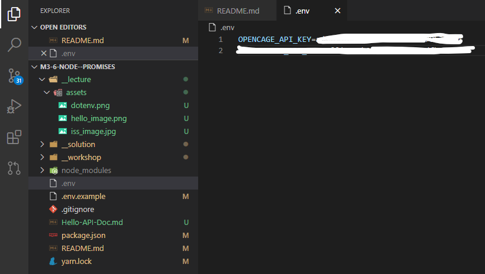

# 4-4 - Node JS - Callbacks and Promises

## Prep Work

### Pre-lecture content

- READ: https://medium.com/javascript-in-plain-english/truly-understanding-promises-in-javascript-cb31ee487860
- WATCH: https://youtu.be/PoRJizFvM7s
- READ: https://codeburst.io/playing-with-javascript-promises-a-comprehensive-approach-25ab752c78c3

## Setup

- `yarn install`

You will not need to spin up a server in this workshop. You can "run" the files individually in the terminal by doing `node <PATH_TO_FILE>`

## Example

Here is an example. There is nothing to do for this example. You can use it as a guide, and to better understand Promises.

```js
// Write a function testNum that takes a number as an argument and returns
// a Promise that tests if the value is less than or greater than the value 10.
const compareToTen = (num) => {
  myPromise = new Promise((resolve, reject) => {
    if (num > 10) {
      resolve(num + " is greater than 10, success!");
    } else {
      reject(num + " is less than 10, error!");
    }
  });
  return myPromise;
};

// Calling the Promise
compareToTen(15)
  .then((result) => console.log(result))
  .catch((error) => console.log(error));

compareToTen(8)
  .then((result) => console.log(result))
  .catch((error) => console.log(error));
```

There is a copy of this code in `exercise-0.js`. You can run it from there.

## Exercise 1

Write two functions that use Promises that you can chain!

- The first function, `makeAllCaps()`, takes in an array of words, capitalizes them and returns a new array.
- The second function, `sortWords()`, takes in an array of words, sorts the words in alphabetical order and return a new array.
- If the array contains anything but strings, it should throw an error.

⚡ Be sure to take a look at how the functions are being called.

---

## NOTE on the rest of the exercises

The exercises below ask you to `return` the output of the Promises. In order to see the result of the promise, you can temporarily output via a console.log the data WITHIN the promise chain (in its own `.then`).

You are `return`ing the value, because you will need this functionality in a later exercise.

If you console.log the function call, you will not see the result because console.log doesn't wait for the promise to be resolved to execute. This why in the previous exercises we console.log in a `.then()` after the Promise is done.

```js
compareToTen(15)
  .then((result) => console.log(result)) // <-- that will console what the promise returns
  .catch((error) => console.log(error));
```

## Calling APIs

Data is one of the most important parts development. Chances are that you'll want to use some sort of external data for your final project. There are APIs for just about everything. Some are free, many are paid, but most have at least a free tier for testing and develop. The challenge in using an external API is in understanding the documentation and figuring out how to use it. Some APIs have great documentation, but many don't.

Today, you'll have to access a variety APIs.

In order to do these exercises, you might also need to know more about the [JSON format](https://www.digitalocean.com/community/tutorials/how-to-work-with-json-in-javascript).

---

## Exercise 2 - Hello! Bonjour! Guten Tag!


For this exercise, we will be working with a homegrown API. Read the [Hello API Doc](./Hello-API-Doc.md) carefully.

### Exercise 2.1 - Testing

Write a Promise using `request-promise` that contacts the `/hello` API. Return the response.

1. Insert the API url (use the test path: `/hello`)
2. `JSON.parse()` the response and return the parsed data. It will move to the next `.then()`
3. Return just the actual greeting, and not the rest of the response. _It should be "Hello" in this case._

```js
const testGreeting = () => {
  return request("<API_URL") // 1
    .then((response) => {
      return; // 2
    })
    .then((parsedResponse) => {
      return; // 3
    })
    .catch((err) => console.log("Error: ", err));
};
```

Note that in Exercise 1, oour promise didn't include a `catch()`. It was attached to the function call. From this exercise onward, let's move it into the promise and let it deal with the errors.

### Exercise 2.2 - How do I say "hello" in... ?

Write a Promise using `request-promise` that contacts the `/hello` API. The function accepts one argument, the language code, and returns a greeting in that language.

1. Insert the appropriate API url
2. Return just the greeting object.
   e.g. `greeting('fr')` should return `{ lang: "French", code: "FR", text: "Bonjour" }`.

The provided test case should console the appropriate greetings

Call the function a few more times with other `langCode`s.

### Exercise 2.3 - Use the Error... gracefully

Errors suck! Our API is pretty good at letting us know that there was an error and what the error was, but if you try a `langCode` that doesn't exist, you get this HUGE error object in the console that is pretty much useless, unless you want to scroll through the whole thing, and look for something useful...

Let's improve on the code you wrote for 2.2.

1. Copy/paste your code from 2.2.
2. Take a look at where you are catching the error inside of the promise. This line `catch`es the error from the server and passes it along.

```js
.catch((err) => console.log('Error: ', err));
```

That `err` object is what we need to clean up. Instead of doing a `console.log`, let's parse the data and return something. The response from the server is located inside of the `err` object at `error`. I don't know why...

Change it to this:

```js
.catch((err) => {
  return err.error ? JSON.parse(err.error) : err;
});
```

Confirm that it works by running the file. You should now see a nice error message as the API intended.

Can you unpack what is happening here? What are we doing? Why?

---

## Exercise 3 - The International Space Station


> The International Space Station (ISS) is a modular space station (habitable artificial satellite) in low Earth orbit. The ISS program is a multi-national collaborative project between five participating space agencies: NASA (United States), Roscosmos (Russia), JAXA (Japan), ESA (Europe), and CSA (Canada). It is an international collaborative effort between multiple countries. The ownership and use of the space station is established by intergovernmental treaties and agreements. ([_Source_](https://en.wikipedia.org/wiki/International_Space_Station))

In this exercise, we are going to work _with_ the ISS. 🤯

## Exercise 3.1 - `getIssPosition`

The first thing we need to do is figure out where the ISS is at the moment. Thankfully, there is a [free API for that](http://api.open-notify.org/)!

1. Complete the code of this function so that it returns the position of the ISS as a `Promise`.
2. Use the data from `http://api.open-notify.org/iss-now.json` to do your work. This API endpoint returns a JSON object, like the one you see when you open the link.
3. The ISS API returns the position keys as `latitude` and `longitude`. Return them as `lat` and `lng` instead.
4. Don't forget to `require` the module you need (`request-promise`). _See a previous exercise, if you aren't sure._

## Exercise 3.2 - `getPositionFromAddress`

Getting the `lat` and `lng` of an address. Write a function that returns the coordinates of a given address.

1. Use the [OpenCage Data API](https://opencagedata.com/) to do this
   - Sign up for an account (free) and follow the various guides to get started. _Use the Gihub option for a quicker signup._
   - Look up `dotenv` on NPM. _It's already been installed._ Comfirm this by looking at the `package.json`.
   - Once that is setup, copy the `.env.example` file and rename it `.env`. **Then add your API key to it.**



### Note:

- Opencage has its own module to help write requests. It's already been installed and is ready to use. You can read up on it here: [https://www.npmjs.com/package/opencage-api-client](https://www.npmjs.com/package/opencage-api-client)

2. Complete the code of this function to return a `Promise` for a lat/lng object.
3. Once you have it working, pass it a few address to see what the responses look like.
4. Make sure to only return an object with lat/lng and not the whole response. _Every API response is different. It will take some trial and error to find the data you're looking for._

```js
// Example
getPositionFromAddress(
  "1455 Boulevard de Maisonneuve O, Montréal, QC H3G 1M8"
).then((response) => console.log(response));
// this should return "{ lat: 45.497118, lng: -73.579044 }"
// (Concordia University)
```

## Exercise 3.3 - `getAddressFromPosition`

Getting the address of provided coordinates. Write a function that returns the address of given `lat` and `lng` coordinates.

```js
// Example
getAddressFromPosition("48.858262", "2.294496").then((response) =>
  console.log(response)
);
// this should return "5 Avenue Anatole France, 75007 Paris, France"
// (The Eiffel Tower?)
```

- This function will be _very_ similar to the previous one. Try to rewrite it without referring back to it more than necessary.

---

<center>🟡 - Minimally complete workshop (75%) - 🟡</center>
  
---

## Exercise 3.4 - `getDistanceFromIss`

Let's put it all together!

- Write a function that will use the previous functions to give us the distance between two points (two sets of coordinates).
- This function should accept an address and return the distance of the ISS from that address.
- There is no need to rewrite all of those functions.
  - Go back to the functions you will need and `export` them.
  - Write this at the bottom of the file:

```js
module.exports = { nameOfFunction };
```

- `require` the function in 3.4 with

```js
const { nameOfFunction } = require("<REL_PATH_TO_FILE>");
```

- You will need to use this "helper" function. It returns the distance between two points.

```js
// Euclidian distance between two points
const getDistance = (pos1, pos2) => {
  return Math.sqrt(
    Math.pow(pos1.lat - pos2.lat, 2) + Math.pow(pos1.lng - pos2.lng, 2)
  );
};
```

Again here you should re-use two previously created functions, plus the `getDistance` function provided below.

One of the functions does address ==> position and the other simply does nothing ==> position. The `getDistance` function needs the two positions to compute the final value.

---

<center>🟢 - Complete workshop (100%) - 🟢</center>

---

## Exercise 4 - Guess The Number (stretch)

This exercise will be done in a new file, `guess-the-number.js`.

Using the `inquirer` module, write a program that will play the "guess the number game":

- Create a random number between 1 and 100. Call it the hidden number
- Start with 5 guesses
- As long as there are guesses left:
  - Ask the user for a number between 1 and 100 until they give you one
  - If they find the hidden number, they win the game. END
  - Otherwise, tell them whether their guess is lower or higher than the hidden number
  - Loop back
- The user has lost the game. `THE END`
