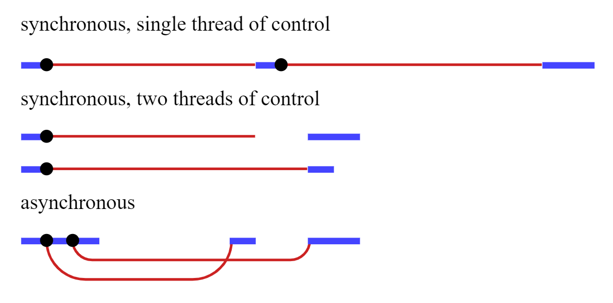

import mdxTheme from '../../../theme';
export const theme = mdxTheme;

import syncAsync from './assets/async_sync.png';

# JS Topic: Callbacks

---

## Synchronous vs. Asynchronous

---

_Synchronous_: Things happens one at a time.

---

_Asynchronous_: Multiple things happen at the same time.

---

### Example

An app that fetches 2 resources from the network, and then combines the results into a final (needed) result.

---



---

### Important Distinction

In a _synchronous_ model, waiting for actions to finish is **implicit**, but in an _asynchronous_ model, it is **explicit**.

---

Synchronous === implicit control

Asynchronous === explicit control

---

Both of the important JavaScript programming platforms (browsers and Node.js) make operations that might take a while **--asynchronous**.

_Examples of operations that might take time?_

---

## Callbacks

What is a callback?

---

- A callback is a function that is to be executed, or _called_ after another function has finished executing.

- Any functions that is passed as an argument to another function is a callback function.

---

```js
console.log("do first thing");
console.log("do second thing");
console.log("do third thing");

// expected output
```

_What is expected here?_

---

What happens if the second thing takes longer than expected?

---

```js
console.log("do first thing");
setTimeout(() => {
  console.log("do second thing");
}, 2000);
console.log("do third thing");
```

---

### Important

JavaScript _did_ execute the functions in the right order,
but it **didn't wait for an answer (response)** before moving on to the next function to execute.

---

## Example

```js
const writeStory = (topic) => {
  alert(`Begin writing a story about ${topic}`);
};

writeStory("traveling to Mars");
```

---

```js
const writeStory = (topic, callback) => {
  alert(`Begin writing a story about ${topic}`);
  callback();
};

writeStory("traveling to Mars", function () {
  alert("Done! Time to submit it.");
});
```

---

Have we used callbacks in any of our code to date?

---


_Examples?_

---

## Callback Hell... or the Pyramid of Doom.

Let's say we have a function that will notify the world of a message after an action is complete.

```js
const tellWorld = (message, callback) => {
  console.log(message);
  callback();
};
```

---

Sooo.... Is a callback _synchronous_ or _asynchronous_?

---

Well that depends...

- `setTimeout`, `setInterval`, requests, and events are asynchronous.
- most other callbacks are synchronous.
